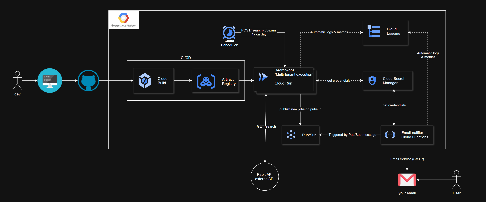

# Search Jobs

Este é um projeto Python para buscar vagas de emprego utilizando a API do RapidAPI.

## Funcionalidades

- Busca de vagas de emprego com base em palavras-chave.
- Suporte para filtros como país, tipo de trabalho (remoto ou presencial) e data de postagem.
- Envia os resultados para o Google Cloud Pub/Sub.
- Suporte para execução com Docker e implantação com Google Cloud Build.

## Requisitos

- Python 3.14 ou superior
- Biblioteca `requests`
- Biblioteca `python-dotenv`
- Google Cloud SDK configurado para Pub/Sub

## Instalação

1. Clone este repositório ou faça o download do código.
2. Certifique-se de ter o Python instalado em sua máquina.
3. Instale as dependências do projeto:
   ```bash
   pip install -r requirements.txt
   ```
4. Crie um arquivo `.env` na raiz do projeto e configure as seguintes variáveis de ambiente:
   ```
   URL_SEARCH_JOBS=https://jsearch.p.rapidapi.com/search
   API_KEY_RAPID=seu_api_key
   RAPID_API_HOST=jsearch.p.rapidapi.com
   NUM_PAGES=3
   COUNTRY=br
   DATA_POSTED=all
   REMOTE_JOB=false
   GCP_PROJECT_ID=seu_projeto_gcp
   PUBSUB_TOPIC_ID=seu_topico_pubsub
   SEARCH_TARGETS=[
       {
           "email": "email1@example.com",
           "keywords": "desenvolvedor backend, desenvolvedor de IA"
       },
       {
           "email": "email2@example.com",
           "keywords": "professor de fisica, professor de matematica"
       }
   ]
   ```

## Uso

1. Execute o script principal:
   ```bash
   python main.py
   ```
2. O resultado será enviado ao Pub/Sub.

3. O projeto pode ser rodado com o Docker fazendo o build da imagem e rodando o container com esses comandos no Makefile:
    ```bash
   make build
   ```
    ```bash
   make run
   ```

4. Para implantar o projeto no Google Cloud Run usando o Cloud Build, utilize o arquivo `cloudbuild.yaml`:
    ```bash
    gcloud builds submit --config cloudbuild.yaml
    ```

## Estrutura do Projeto

- `main.py`: Script principal para buscar vagas e enviar ao Pub/Sub.
- `requirements.txt`: Lista de dependências do projeto.
- `README.md`: Documentação do projeto.
- `Makefile`: Comandos úteis para automação.
- `.env`: Arquivo para configuração de variáveis de ambiente.
- `cloudbuild.yaml`: Configuração para build e implantação no Google Cloud Run.
- `assets`: Pasta com o desenho de arquitetura do projeto

## Arquitetura


## Contribuição

Contribuições são bem-vindas! Sinta-se à vontade para abrir issues ou enviar pull requests.

## Licença

Este projeto está licenciado sob a licença MIT. Consulte o arquivo `LICENSE` para mais detalhes.

## Contato

- Autor: Juan de Carvalho
- Email: [juancalheiros0001@gmail.com](mailto:juancalheiros0001@gmail.com)